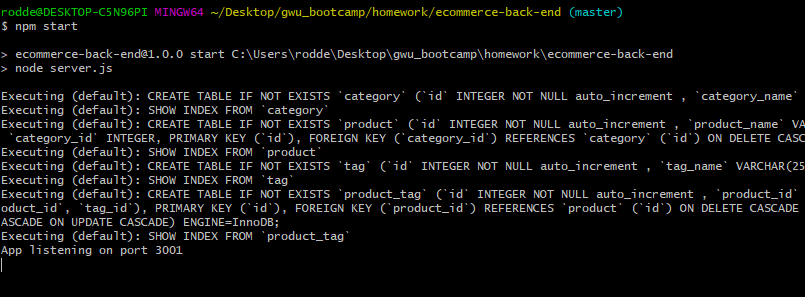
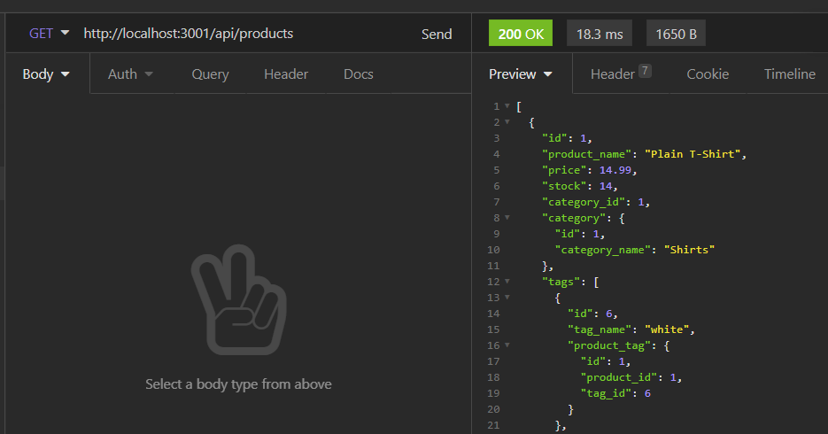
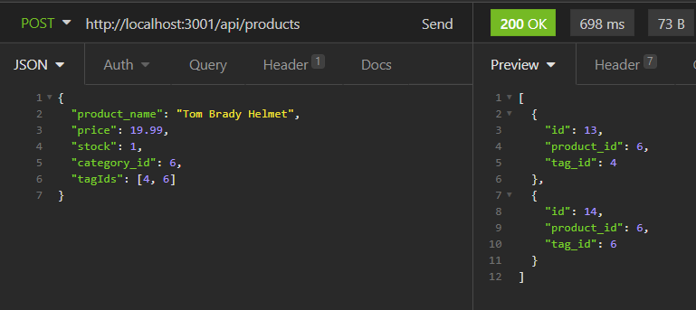

# eCommerce Back End

## Table of Contents
- [Project Overview](#project-overview) 
- [Installation](#installation)
- [Demo](#demo)
- [License](#license)
- [Screenshots](#screenshots)

## Project Overview
E-commerce back end application run using MySQL database and Sequelize and Express Node.js packages. Data is hosted across four different tables that related using Sequelize associations and foreign keys. Express is used to access, create and remove data using AJAX get, post, put and delete requests.

### Languages Used
- JavaScript (Node.js)
- SQL (mySQL)

### Libraries Used
- [mySQL](https://www.npmjs.com/package/mysql)
- [Sequelize](https://www.npmjs.com/package/sequelize)
- [Express](https://www.npmjs.com/package/express)
- [Dotenv](https://www.npmjs.com/package/dotenv)

## Installation
Node.js is _required_ to use this application. Once cloned/downloaded from GitHub, run command "npm i" in command line to install the packages referenced under Libraries Used automatically. 

Then, make sure to update [.env.EXAMPLE](./.env.EXAMPLE) to hold your specific SQL credentials and database information so that the server.js file can connect to the server and update file name to .env. 

Then, create the SQL database by running the commands in [schema.sql](./db/schema.sql). Next, seed the data by running command "npm run seed" in command line to add test data to the database. You should now be ready to launch the application by running command "npm start."

## Demo
[View the demonstration video on YouTube](https://youtu.be/7qYkzvuhWlI)

## License
Permission is hereby granted, free of charge, to any person obtaining a copy of this Software and associated documentation files (the "Software"), to deal in the Software without  restriction, including without limitation the rights to use, copy, modify, merge, publish distribute, sublicense, and/or sell copies of the Software, and to permit persons to whom the Software is furnished to do so, subject to the following conditions.

[View the full license](./LICENSE)

## Screenshots

